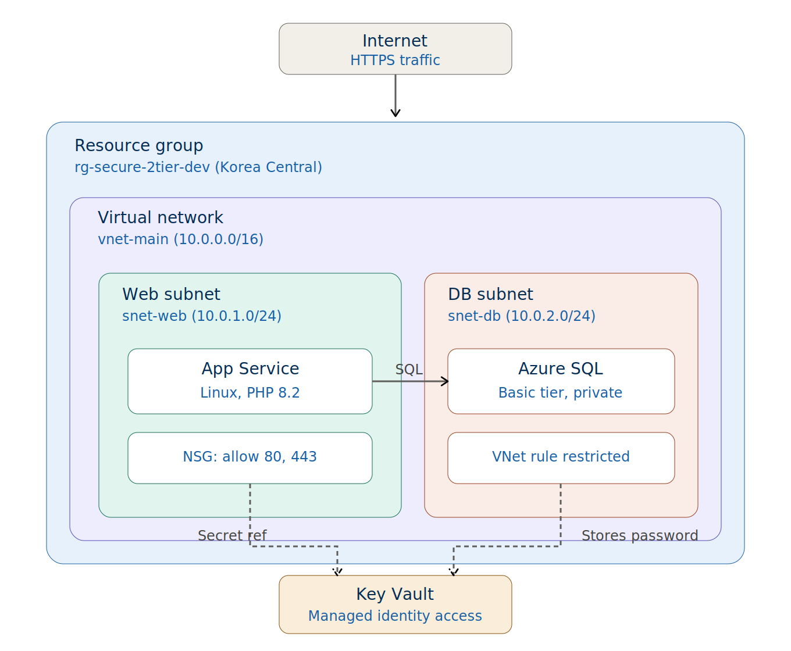
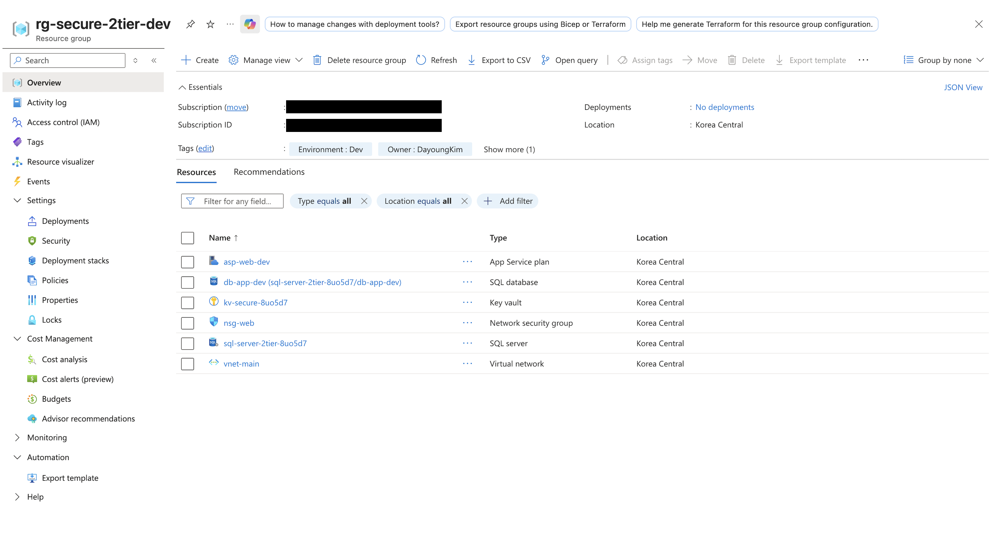
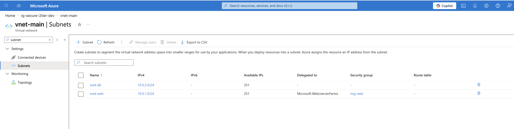
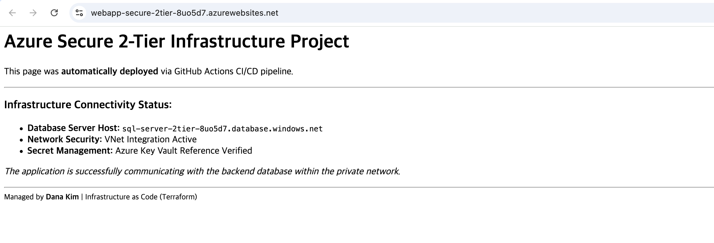

# Secure 2-Tier Azure Architecture with Terraform

Automated deployment of a **Web + Database 2-tier architecture** on Azure,
with network isolation, Managed Identity, and Key Vault secret management.

> ⚡ Built and deployed in 1 day as a portfolio project.

---

## Architecture
Internet
│
▼
[App Service] ── VNet Integration ──► [snet-web 10.0.1.0/24]
│                                         │
│ Key Vault Reference                     │ VNet Rule
▼                                         ▼
[Key Vault]                          [Azure SQL Database]
(Managed Identity)                   [snet-db 10.0.2.0/24]

## Security Design Decisions

| What | Why |
|------|-----|
| DB in private subnet | Direct internet access to SQL is blocked |
| Key Vault secret reference | Password never appears in code or env vars |
| Managed Identity | No credentials stored — App accesses Key Vault automatically |
| NSG on web subnet | Only port 80/443 allowed inbound |

---

## Tech Stack

- **IaC**: Terraform >= 1.5.0
- **Cloud**: Microsoft Azure (Korea Central)
- **Compute**: Azure App Service (Linux, PHP 8.2)
- **Database**: Azure SQL Database (Basic tier)
- **Security**: Key Vault, Managed Identity, NSG, VNet Integration

---

## ⚡ Quick Start

```bash
git clone https://github.com/danakim1004au-prog/terraform-azure-web-db-automation
cd terraform-azure-web-db-automation

# 1. Initialize
terraform init

# 2. Preview (no Azure account needed to run this)
terraform plan -var="db_admin_password=YourPassword123!"

# 3. Deploy
terraform apply -var="db_admin_password=YourPassword123!"
```

---

## Project Structure
├── main.tf              # All Azure resources
├── variables.tf         # Input variables
├── .gitignore           # Excludes tfstate, tfvars
├── .terraform.lock.hcl  # Provider version lock
├── src/                 # Sample PHP app
└── .github/workflows/   # GitHub Actions CI/CD

---

## Troubleshooting Log

| Issue | Cause | Fix |
|-------|-------|-----|
| `.tfstate` exposed to Git | `.gitignore` not set before first commit | Deleted repo → `git rm --cached` → re-initialized |
| GitHub Actions login failed | `AZURE_CREDENTIALS` secret missing `workflow` scope | Regenerated PAT with correct permissions |
| Key Vault access denied | Web App identity not granted policy | Added `azurerm_key_vault_access_policy` for webapp identity |

---

## What I Learned

- `tfstate` contains sensitive data — **never commit it**
- Managed Identity eliminates credential management entirely
- Service Endpoints vs Private Endpoints trade-offs

---

*Deployed and verified on Azure Portal — infrastructure destroyed after testing to manage costs.*



## 📸 Deployment Evidence

### Azure Resources Overview


### Network Isolation (VNet & Subnets)


### Live Website
